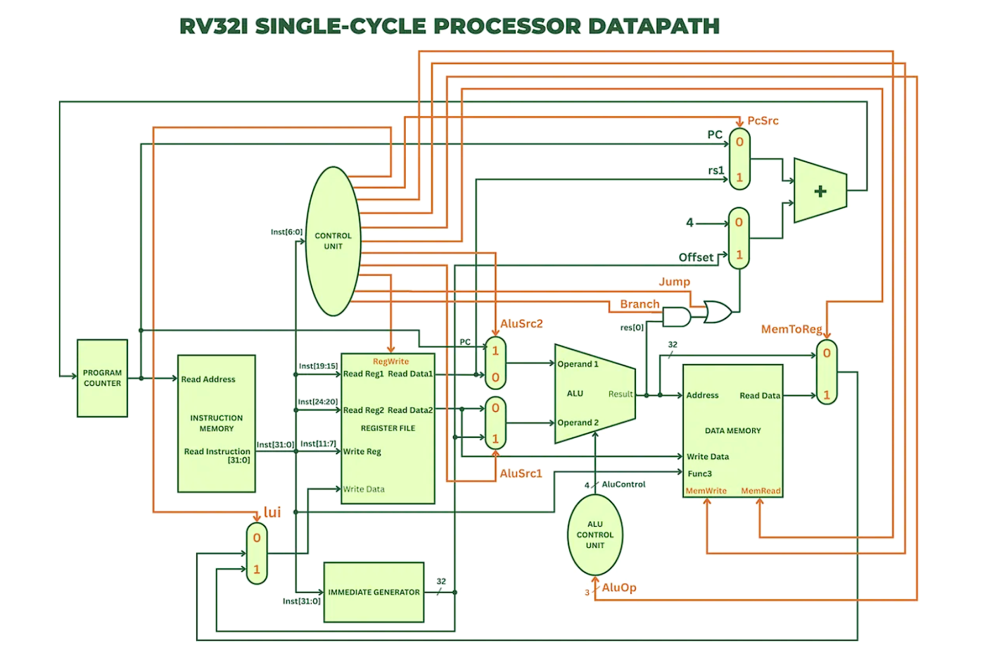

## Hardware and Software Tools

The physical implementation and simulation of this processor relied on a robust stack of development tools:

### Software Environment
* **Verilog HDL:** The primary structural design language used to code and integrate all datapath modules.
* **Xilinx Vivado Design Suite:** The core IDE utilized for logic synthesis, physical implementation, and generating the final FPGA bitstream.
* **Vivado Simulator (XSIM):** Employed for rigorous behavioral verification and waveform analysis prior to hardware deployment.
* **Windows PowerShell:** Acted as the command-line interface, establishing an asynchronous 115200-baud UART serial connection with the hardware.

### Hardware Platform
* **Digilent ARTY S7 FPGA:** The target physical platform, featuring a Xilinx Spartan-7 chip equipped with sufficient logic cells and block RAM to house the 32-bit architecture.
* **Micro-USB Bridge:** Handled both power delivery and the UART serial communication between the host PC and the FPGA.

---

## Core Architecture & Instruction Formats

This processor executes a fundamental subset of the RV32I base instruction set. Instructions are dynamically decoded into specific operational formats:

* **R-Type (Register):** Performs arithmetic/logic operations (e.g., `ADD`, `SUB`, `AND`, `OR`) using two source registers (`rs1`, `rs2`) and storing to a destination register (`rd`).
* **I-Type (Immediate):** Combines one source register with a 12-bit signed immediate value (e.g., `LW`).
* **S-Type (Store):** Splits the 12-bit immediate field to maintain source register positions, used for memory storage (e.g., `SW`).
* **B-Type (Branch):** Evaluates conditions between registers to calculate PC-relative memory jumps (e.g., `BEQ`).

---

## The 5-Stage Single-Cycle Datapath

Every instruction completes its entire lifecycle within a single clock cycle, flowing through five distinct architectural stages:

1. **Instruction Fetch:** The Program Counter (PC) retrieves the 32-bit machine code from Instruction Memory while simultaneously incrementing to the next address.
2. **Instruction Decode:** The Control Unit parses the Opcode and extracts the necessary register addresses, allowing the Register File to output the stored data.
3. **Execute:** The Arithmetic Logic Unit (ALU) computes the required mathematical operation, logical shift, or branch condition.
4. **Memory Access:** For LW and SW instructions, the datapath interacts directly with the Data Memory block.
5. **Write Back:** A multiplexer routes either the ALU computation or the retrieved memory data permanently back into the destination register.

---

##  System Integration & Core Modules

The system architecture was built using a robust, bottom-up design methodology. Core modules were structurally coded and verified independently before centralized integration:

* **Program Counter (PC):** A 32-bit tracker that increments sequentially or updates via Branch targets.
* **Register File:** Contains thirty-two 32-bit registers (with `x0` hardwired to zero), supporting simultaneous dual-read and single-write operations.
* **Control Unit & ALU:** The "brain" and "engine" of the CPU. The Control Unit generates precise electrical routing signals, while the ALU executes the mathematics.
* **UART MMIO:** Custom receiver and transmitter modules allow real-time asynchronous communication with the physical FPGA board.

---

##  Advanced Microarchitecture Upgrades

To push the processor beyond basic arithmetic and demonstrate complex algorithmic execution, the base datapath was heavily upgraded:

### 1. ALU Expansion
The original 3-bit ALU control signal was widened to 4 bits, expanding hardware execution capacity to 16 distinct operations. This allowed native integration of the Set Less Than (`SLT`) instruction for rapid signed binary comparisons.

### 2. Software-Level Branching
To adhere strictly to RISC design philosophies, physical silicon gates were conserved by omitting dedicated hardware for "Greater Than" (`>`) and "Equal To" (`==`). 
* `>` is synthesized by software swapping the registers and utilizing the hardware `SLT`.
* `==` is synthesized by commanding a hardware subtraction and branching off the ALU's zero flag. 

### 3. Dual-Execution Architecture
The processor proves its autonomy via a dual-state Von Neumann memory layout:
* **The Bootloader Sequence:** Upon reset, the CPU runs an isolated assembly algorithm using dedicated registers (`x20`-`x25`) to calculate the Fibonacci sequence and populate the data memory.
* **The Application Loop:** Once the boot sequence is complete, the processor executes an absolute jump (`JALR`), gracefully dropping into an infinite Memory-Mapped I/O polling loop to operate as an interactive calculator.

